# Guía de Diapositivas y Guión de Presentación (10 Minutos)
## *Entrega 2 - BetAnalytics: Sistema Dual de Inversión Cuantitativa*

Este documento está diseñado bajo la restricción estricta de una **presentación de 10 minutos (apróx. 1 minuto por diapositiva)**. Enfoca la narrativa en **iteraciones, métricas y su interpretación**, omitiendo detalles técnicos redundantes para ajustarse a los requerimientos de la pauta.

---

### 🗂️ RESUMEN DEL CONTENIDO DE DIAPOSITIVAS

```mermaid
gantt
    title Planificación de Tiempo de la Presentación (10 Minutos)
    dateFormat  X
    axisFormat %M:%S
    
    Slide 1: Portada y Problema            :active, 0, 60
    Slide 2: Iteración Preprocesamiento   : 60, 120
    Slide 3: Validación y Optuna (Capa 1) : 120, 180
    Slide 4: Paradoja del Empate          : 180, 240
    Slide 5: Calibración (Capa 2)         : 240, 300
    Slide 6: Filtros Cuantitativos (Capa 3): 300, 360
    Slide 7: Meta-Labeling (Capa 2 Decisión): 360, 420
    Slide 8: Resultados Financieros       : 420, 500
    Slide 9: Conclusiones y Defensa       : 500, 540
    Ronda de Preguntas (Jury)              : 540, 600
```

---

## 💻 Slide 1: Portada y Conexión con el Problema Inicial (1:00 min)
*   **Título:** BetAnalytics: Sistema Dual de Decisiones e Inversión en la Premier League.
*   **Contenido Visual:** Logo del proyecto, nombres de los integrantes. Esquema simple del problema.
*   **Métricas en pantalla:** 
    *   *El enemigo:* Comisión implícita de las casas de apuestas (Overround de Bet365 = **~6.38%**).
    *   *El mercado:* Premier League (uno de los mercados deportivos más eficientes y líquidos del mundo).
*   **Qué decir:**
    > *"Buenas tardes. Nuestro proyecto, BetAnalytics, aborda un problema clásico de las finanzas cuantitativas: ¿Es posible vencer matemáticamente la comisión de la casa de apuestas en un mercado altamente líquido y eficiente como la Premier League utilizando Machine Learning?
    > En la Presentación 1 demostramos que predecir partidos de fútbol es posible. Hoy presentaremos la iteración completa del pipeline, demostrando cómo una arquitectura modular de tres capas logra neutralizar el overround comercial y convertir un modelo predictivo en un activo de inversión rentable y de bajo riesgo."*

---

## 💻 Slide 2: Iteración 1 - Ingesta y Preprocesamiento de Datos (1:00 min)
*   **Contenido Visual:** Gráfico `1_Missing_Values_Antes_y_Despues.png` y `3_Multicolinealidad_Antes_y_Despues.png` (en miniatura).
*   **Métricas y Cambios Clave:**
    *   *KNNImputer:* Imputación consistente de nulos en xG (Expected Goals) asumiendo un mecanismo estadístico MAR (Missing at Random).
    *   *Tomek Links:* Limpieza de ruido e imprecisión en las fronteras de decisión de empates (`1X2`) y valla invicta local (`HCS`).
*   **Qué decir:**
    > *"Nuestra primera iteración se centró en la calidad del dato. En lugar de remover registros o usar imputaciones simples que añaden sesgo, aplicamos un KNNImputer estadísticamente válido para nulos históricos. 
    > Además, detectamos que las clases de 'Empate' y 'Vallas Invictas' presentaban fronteras de decisión muy difusas debido al desbalance. Para corregir este error de etapas previas, aplicamos un remuestreo híbrido basado en Tomek Links únicamente en los conjuntos de entrenamiento, limpiando el ruido en la frontera de clasificación antes de pasar a la optimización de los modelos."*

---

## 💻 Slide 3: Iteración 2 - Validación Temporal y Modelado (Capa 1) (1:00 min)
*   **Contenido Visual:** Tabla comparativa del cuadro de honor de los 8 mercados y referencia a `30_Comparativa_Baseline_vs_Optuna.png`.
*   **Métricas y Cambios Clave:**
    *   *Error corregido:* Eliminación de `train_test_split` aleatorio (evita fuga de datos del futuro). Implementación de **`TimeSeriesSplit`** (5 splits).
    *   *Optuna Tuning (TPE):* Sintonización bayesiana de 5 algoritmos (Logistic Regression, RF, HistGradientBoosting, XGBoost, MLP PyTorch).
    *   *Métrica ganadora:* Redes Neuronales MLP con Dropout alcanzan **70.99% de Accuracy** en Valla Invicta Local.
*   **Qué decir:**
    > *"El error más grave de la Presentación 1 fue el riesgo de fuga temporal al mezclar años en la validación. Lo corregimos implementando TimeSeriesSplit cronológico. Ningún modelo entrenó con datos del futuro.
    > Evaluamos cinco algoritmos de distinta complejidad optimizados mediante Optuna. Logramos exactitudes muy robustas de validación ciega: un 70.82% en Doble Oportunidad 1X y un pico del 70.99% en Valla Invicta Local utilizando una Red Neuronal MLP en PyTorch regularizada con un 30% de dropout para mitigar el sobreajuste."*

---

## 💻 Slide 4: Interpretación 1 - La Paradoja del Empate (1:00 min)
*   **Contenido Visual:** Gráfico `33_Explicacion_F1_1X2.png` (Visualización de F1-Score).
*   **Métricas y Cambios Clave:**
    *   *Métricas:* Aumento del Accuracy general a **52.84%** en mercado 1X2, pero caída del F1-Score en la clase Empate a **0.00**.
*   **Qué decir:**
    > *"Al evaluar las métricas, nos encontramos con un dilema técnico: la Regresión Logística optimizada para exactitud en el mercado 1X2 colapsó las predicciones de empates a cero. Esto parecería un error, pero la interpretación es puramente matemática.
    > Dado que el empate es un evento de altísima varianza (frecuencia ~25%) y las cuotas de local/visitante son más estables, el optimizador bayesiano prefiere concentrar las predicciones en las dos clases mayoritarias. Esto maximiza la tasa de acierto general del modelo (Accuracy) y reduce la varianza de falsos positivos en empate, asumiendo un criterio técnico realista de asignación de probabilidades."*

---

## 💻 Slide 5: Iteración 3 - Calibración Estadística de Probabilidades (Capa 2) (1:00 min)
*   **Contenido Visual:** Gráfico `35_Simulacion_Rentabilidad_Apuestas.png` (Curvas de capital sin calibrar vs. calibrada).
*   **Métricas y Cambios Clave:**
    *   *Sin Calibrar (Modelo Raw):* Banca final de **$8.77 USD** (Quiebra, ROI de -6.21%).
    *   *Calibración Isotónica (Capa 2):* Banca final de **$1,334.42 USD** (ROI de **+1.44%**).
*   **Qué decir:**
    > *"Aquí está la iteración financiera más importante del proyecto. Un modelo de ML predice clases, pero no está calibrado financieramente. Si el modelo estima un 80% de probabilidad pero el evento ocurre un 60%, el overround de la casa de apuestas nos quiebra.
    > Lo demostramos empíricamente: operar con el modelo raw nos lleva a la banca rota ($8.77 de capital final). Para corregir esto, inyectamos una Capa de Calibración Isotónica. Al alinear la probabilidad estimada con la frecuencia empírica real, neutralizamos la comisión de la casa y estabilizamos la banca en $1,334.42 de forma consistente."*

---

## 💻 Slide 6: Iteración 4 - Gestión de Riesgos y Filtros Cuantitativos (Capa 3) (1:00 min)
*   **Contenido Visual:** Gráfico `45_Simulacion_Configuraciones_Optimas.png` o `43_Sensibilidad_Filtro_Probabilidad.png` (en miniatura).
*   **Métricas y Cambios Clave:**
    *   *Filtro de Probabilidad:* `Prob >= 30%` reduce el Drawdown Máximo en un **11%** (banca: **$1,054.46**).
    *   *Favorite-Longshot Bias:* Excluir favoritos en goles da un ROI de **+0.49%**, pero en mercados reales líquidos (1X2) los favoritos son más rentables (**ROI: -0.70%**).
*   **Qué decir:**
    > *"Evaluamos el impacto de restringir las apuestas mediante filtros cuantitativos de probabilidad mínima y rango de cuotas. El análisis de sensibilidad demostró la presencia del Favorite-Longshot Bias: en mercados secundarios de goles, las sorpresas de cuotas altas contienen ineficiencias rentables (+0.49% ROI); sin embargo, en mercados reales líquidos como el 1X2, los favoritos son mucho más eficientes y seguros.
    > Asimismo, demostramos que exigir una probabilidad de acierto mínima del 30% actúa como amortiguador psicológico, reduciendo el drawdown máximo en un 11% a costa de una leve baja en volumen."*

---

## 💻 Slide 7: La Solución Definitiva - El Motor de Meta-Decisión (1:00 min)
*   **Contenido Visual:** Diagrama conceptual de arquitectura [47_Arquitectura_Sistema_Dual.png](file:///c:/Users/sergi/Desktop/datascience/Carpeta_Presentacion/47_Arquitectura_Sistema_Dual.png).
*   **Métricas y Cambios Clave:**
    *   *Meta-Labeling (López de Prado):* Un clasificador RandomForest secundario entrenado walk-forward sobre aciertos/errores de la Capa 1.
    *   *Entrada:* `prob`, `odd`, `ev`, `elo_diff`, `rest_diff`.
    *   *Independencia:* Capa desacoplada; los modelos XGBoost/MLP primarios no sufren cambios.
*   **Qué decir:**
    > *"Para maximizar la rentabilidad en mercados reales y líquidos, implementamos Meta-Labeling. El modelo principal estima la probabilidad del fútbol. Pero entrenamos un RandomForest de segunda capa para estimar la probabilidad de éxito de nuestra propia decisión de inversión basándose en el contexto deportivo (fatiga, ELO) y el precio (cuota, EV).
    > Esta estructura es completamente desacoplada. Los modelos primarios no se alteran. El Meta-Modelo actúa únicamente como una válvula inteligente que bloquea la apuesta si la probabilidad estimada de acierto financiero es menor al 50%."*

---

## 💻 Slide 8: Resultados Financieros Consolidados (¿Ganamos dinero?) (1:30 min)
*   **Contenido Visual:** Tabla comparativa de resultados financieros reales y gráfico de capital [46_Simulacion_Meta_Labeling.png](file:///c:/Users/sergi/Desktop/datascience/Carpeta_Presentacion/46_Simulacion_Meta_Labeling.png).
*   **Métricas Clave:**
    *   *Filtro Quirúrgico:* El Meta-Modelo evita **1,433 apuestas perdedoras** (filtra el 63.4% del ruido).
    *   *Banca Final:* Sube de $582.74 a **$1,823.62** (Meta-Modelo) y **$1,711.82** (Sistema Dual).
    *   *ROI:* Sube del -1.85% al **+9.96%** (Meta-Modelo) y **+8.52%** (Sistema Dual).
    *   *Max Drawdown:* Cae del **77.26% al 19.23%** (reducción del 75% del riesgo).
*   **Qué decir:**
    > *"Los resultados financieros sobre cuotas reales de Bet365 son concluyentes. La Línea Base del modelo principal pierde dinero gradualmente por la comisión (-1.85% ROI, drawdown inviable del 77%).
    > Al activar el Meta-Modelo, el sistema detecta y evita 1,433 apuestas falsas positivas. Esto provoca un salto del ROI neto al +9.96% (banca final de $1,823.62). Lo más impresionante es el control del riesgo: el Drawdown Máximo se desploma del 77% al 19.23% (una caída del 75% en la volatilidad). Esto convierte el portafolio en una estrategia de inversión institucionalmente estable y rentable."*

---

## 💻 Slide 9: Conclusiones y Defensa Metodológica (0:30 min)
*   **Contenido Visual:** Tres pilares en pantalla: 1) Blindaje Temporal, 2) Calibración Financiera, 3) Modularidad de Capas.
*   **Qué decir:**
    > *"En conclusión, hemos implementado una solución de Data Science completa y robusta alineada a la práctica moderna:
    > Primero, blindamos la validación contra data leakage temporal. Segundo, integramos calibración para alinear el modelo con el precio del mercado. Tercero, implementamos Meta-Labeling para gestionar el riesgo y filtrar falsos positivos de forma contextual. El resultado es un sistema rentable con cuotas reales y un perfil de riesgo altamente controlado. Quedamos abiertos a sus preguntas. Muchas gracias."*
