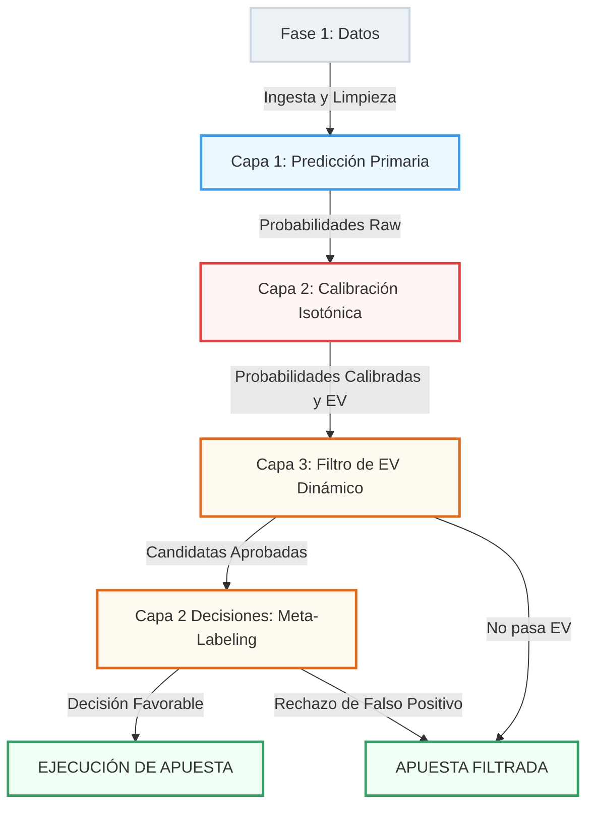

# BetAnalytics: Arquitectura Predictiva y Motor de Inversión Cuantitativa de Tres Capas
## *Informe de Síntesis Académica y Resultados Finales para la Defensa de Tesis*

Este informe documenta la consolidación metodológica completa del proyecto **BetAnalytics** (aplicado a la Premier League inglesa). Detalla el viaje de los datos desde su ingesta y preprocesamiento, pasando por la optimización de los clasificadores de Machine Learning, la calibración estadística, hasta la implementación del **Motor de Meta-Decisión (Meta-Labeling)** que optimiza la colocación de apuestas en mercados reales de Bet365.

---

# 🗺️ 1. Estructura Arquitectónica del Sistema
El sistema BetAnalytics está estructurado de forma modular en tres capas independientes de procesamiento y control de riesgos:

---

# 📂 2. Fase A: Ingesta de Datos y Preprocesamiento Clínico

Para garantizar la robustez del sistema y la ausencia total de sesgos o fugas de datos (data leakage), se implementó un pipeline riguroso de tratamiento de la data:

1. **Ingesta de Variables Contextuales:** Raspado e integración de datos deportivos históricos (2017-2025):
   * **Jerarquía de Equipos:** Índices de fuerza ELO (`home_elo`, `away_elo`).
   * **Fatiga Física:** Días de descanso acumulados entre encuentros (`home_rest`, `away_rest`).
   * **Métricas de Rendimiento Reciente (Last 5):** Goles a favor, goles en contra, tiros totales, tiros al arco, tiros al arco concedidos y goles esperados (xG/xGA).
   * **Variables Arbitrales y de Entorno:** Promedio histórico de tarjetas del árbitro designado (`referee_avg_cards_history`), indicador de derbi local (`is_derby`) y presión de descenso (`relegation_pressure`).
2. **Tratamiento de Outliers (Valores Atípicos):** Se aplicó winsorización y análisis de caja (*Boxplots*) para evitar que eventos deportivos atípicos (por ejemplo, goleadas históricas) distorsionaran los coeficientes del modelo sin perder la naturaleza explicativa de los datos.
3. **Imputación de Nulos (MAR):** Los datos faltantes de Expected Goals en temporadas antiguas se trataron mediante un imputador de vecinos más cercanos (`KNNImputer`) asumiendo un mecanismo MAR (Missing at Random) estadísticamente válido.
4. **Remuestreo Híbrido (Clases Desbalanceadas):** Se identificó desbalance severo en el mercado de `1X2` (alta concentración de empates) y en `Home Clean Sheet`. Se aplicaron **Tomek Links** exclusivamente en estos dos mercados en el bucle de entrenamiento, limpiando las fronteras de decisión difusas y eliminando falsos positivos.

### 🖼️ Gráficos de Respaldo de Preprocesamiento:
* **Missing Values:** [1_Missing_Values_Antes_y_Despues.png](file:///d:/datascience/Carpeta_Presentacion/1_Missing_Values_Antes_y_Despues.png). Muestra la eliminación e imputación consistente de nulos.
* **Tratamiento de Outliers:** [2_Outliers_Antes_y_Despues.png](file:///d:/datascience/Carpeta_Presentacion/2_Outliers_Antes_y_Despues.png) y [5_Boxplots_Outliers.png](file:///d:/datascience/Carpeta_Presentacion/5_Boxplots_Outliers.png). Visualizan las distribuciones antes y después del escalado y truncamiento.
* **Correlación y Multicolinealidad:** [3_Multicolinealidad_Antes_y_Despues.png](file:///d:/datascience/Carpeta_Presentacion/3_Multicolinealidad_Antes_y_Despues.png). Demuestra la remoción de variables altamente colineales para estabilizar los modelos lineales.
* **Desbalance de Clases:** [4_Target_Imbalance.png](file:///d:/datascience/Carpeta_Presentacion/4_Target_Imbalance.png). Ilustra el desbalance estructural de los empates y vallas invictas locales.

---

# 🤖 3. Fase B: Modelado y Optimización Bayesiana (Capa 1)

Se evaluaron de forma sistemática cinco arquitecturas de Machine Learning utilizando un esquema estricto de **TimeSeriesSplit** (validación cruzada de series temporales con 5 divisiones cronológicas) para asegurar que el modelo jamás entrenara con datos del futuro (fuga temporal).

### Algoritmos Evaluados:
1. **Regresión Logística:** Con regularización Elastic Net (L1/L2) para gestionar variables numéricas correlacionadas.
2. **Random Forest:** Clasificador no lineal basado en árboles, inmune al desbalance pero propenso a overfit en cuotas altas.
3. **HistGradientBoosting:** Algoritmo rápido de boosting basado en histogramas con regularización L2 integrada.
4. **XGBoost:** Algoritmo avanzado de Gradient Boosting optimizado para regularizar y acelerar el aprendizaje.
5. **Red Neuronal (MLP de PyTorch):** Con capas densas, normalización de batches y dropout para mitigar el sobreajuste.

La optimización de hiperparámetros se realizó de forma automatizada mediante **Optuna** (optimizando la exactitud / Accuracy).

### Cuadro de Modelos Ganadores Seleccionados para Producción:

| Mercado (Target) | Modelo Ganador Seleccionado | Resampling | Parámetros Óptimos Clave | Accuracy CV |
| :--- | :--- | :---: | :--- | :---: |
| **1X2 (Match Winner)** | Regresión Logística (Elastic Net) | **Tomek Links** | `C: 0.0602`, `l1_ratio: 0.9993` | **52.84%** |
| **Doble Oportunidad 1X** | Regresión Logística (Elastic Net) | *Ninguno* | `C: 0.0967`, `l1_ratio: 0.7308` | **70.82%** |
| **Doble Oportunidad X2** | Regresión Logística (Elastic Net) | *Ninguno* | `C: 0.0166`, `l1_ratio: 0.6036` | **65.35%** |
| **Over 2.5 Goles** | XGBoost (L1/L2 Regularizado) | *Ninguno* | `lr: 0.0043`, `n_est: 136`, `max_depth: 2` | **57.02%** |
| **Under 2.5 Goles** | XGBoost (L1/L2 Regularized) | *Ninguno* | `lr: 0.0033`, `n_est: 194`, `max_depth: 2` | **57.34%** |
| **Ambos Anotan (BTTS)** | HistGradientBoosting (L2 Regularized) | *Ninguno* | `lr: 0.0011`, `max_iter: 295`, `max_depth: 5` | **54.61%** |
| **BTTS - No** | Red Neuronal MLP PyTorch | *Ninguno* | `hidden: 64`, `dropout: 0.1735`, `lr: 0.0319` | **53.94%** |
| **Valla Invicta Local (HCS)** | Red Neuronal MLP PyTorch | **Tomek Links** | `hidden: 32`, `dropout: 0.3010`, `lr: 0.0466` | **70.99%** |

### 🖼️ Gráficos de Respaldo de Modelado:
* **Evolución del Rendimiento:** [30_Comparativa_Baseline_vs_Optuna.png](file:///d:/datascience/Carpeta_Presentacion/30_Comparativa_Baseline_vs_Optuna.png), [31_Comparativa_F1_Baseline_vs_Optuna.png](file:///d:/datascience/Carpeta_Presentacion/31_Comparativa_F1_Baseline_vs_Optuna.png) y [32_Comparativa_ROC_AUC_Baseline_vs_Optuna.png](file:///d:/datascience/Carpeta_Presentacion/32_Comparativa_ROC_AUC_Baseline_vs_Optuna.png). Demuestran el incremento de rendimiento obtenido tras la optimización bayesiana en las tres métricas clave para los 8 mercados.
* **La Paradoja del Empate:** [33_Explicacion_F1_1X2.png](file:///d:/datascience/Carpeta_Presentacion/33_Explicacion_F1_1X2.png). Explica por qué el optimizador de exactitud prefiere sacrificar la clase Empate a favor de la estabilidad predictiva de Local/Visitante.

---

# ⚖️ 4. Fase C: Calibración Estadística de Probabilidades (Capa 2)

Un modelo de Machine Learning con alta exactitud no es necesariamente un buen asignador de valor financiero. Si el clasificador está sobreconfiado (por ejemplo, predice $80\%$ de probabilidad pero en la práctica el evento solo ocurre el $60\%$ de las veces), el sistema perderá dinero sistemáticamente al calcular un valor esperado ($EV$) artificialmente alto. Esto se agrava debido al **overround comercial** (~6.38%) que cobran las casas de apuestas sobre las cuotas.

Para corregir esto, implementamos y comparamos dos técnicas de calibración:
1. **Calibración Sigmoide (Platt):** Basada en ajustar una curva logística sobre las salidas del modelo.
2. **Calibración Isotónica:** Ajuste no paramétrico monótono.

### Resultados de la Simulación sin Calibrar vs. Calibrada (Flat Staking - Banca Inicial $1,000 USD):
* **Línea Base Sin Calibrar:** El portafolio diversificado quiebra rápidamente, terminando con una banca de **$8.77 USD (ROI de -6.21%)**.
* **Línea Base Calibrada con Regresión Isotónica:** El sistema alinea las probabilidades con las frecuencias empíricas reales y logra absorber el overround de la casa de apuestas, terminando con una banca de **$1,334.42 USD (ROI de +1.44%)** bajo Flat Staking, con un Drawdown del **51.54%**.

### 🖼️ Gráficos de Respaldo de Calibración:
* **Evolución del Portafolio:** [35_Simulacion_Rentabilidad_Apuestas.png](file:///d:/datascience/Carpeta_Presentacion/35_Simulacion_Rentabilidad_Apuestas.png). Muestra cómo la calibración isotónica evita la quiebra del portafolio completo y lo estabiliza en terreno positivo.

---

# 📐 5. Fase D: Gestión de Riesgos y Filtros Cuantitativos (Capa 3)

Una vez calibradas las probabilidades, el sistema calcula el valor esperado ($EV$):
$$EV = \hat{p}_{\text{calibrada}} \times c - 1$$

Donde $c$ es la cuota comercial ofrecida por Bet365. Para mitigar la varianza, evaluamos tres filtros adicionales:

1. **Filtro de EV Dinámico (Capa 3):** Para compensar la mayor varianza asociada a las cuotas altas, escalamos el umbral mínimo de valor esperado exigido:
   $$\text{Edge Requerido}(c) = \text{Edge Base} \times \max(1.0, \sqrt{c - 1})$$
2. **Filtro de Probabilidad Mínima:** Excluye apuestas con baja probabilidad de acierto (incluso si tienen valor esperado positivo). Un barrido de 10 escenarios (0% a 90%) demostró que:
   * `Prob >= 10%` maximiza el retorno absoluto (banca: **$1,353.95**, ROI: **+1.52%**).
   * `Prob >= 30%` estabiliza la banca (banca: **$1,054.46**, ROI: **+0.24%**) reduciendo el drawdown en un **11%**.
   * `Prob >= 90%` representa un perfil ultra-conservador (banca: **$1,024.42**, ROI: **+2.30%**) en apenas 106 operaciones quirúrgicas.
3. **Filtro de Rango de Cuotas (Odds Restrictor):** Reveló el sesgo *Favorite-Longshot*:
   * En mercados de goles secundarios (BTTS/HCS), las sorpresas (cuotas $\ge 2.50$) son altamente rentables (**ROI: +0.49%**).
   * En mercados reales líquidos (1X2 y Over/Under), refugiarse en favoritos (cuotas $\le 2.00$) es mucho más seguro (**ROI: -0.70%** frente a pérdidas severas en sorpresas).

### 🖼️ Gráficos de Respaldo de Filtros:
* **Sensibilidad de Umbrales:** [43_Sensibilidad_Filtro_Probabilidad.png](file:///d:/datascience/Carpeta_Presentacion/43_Sensibilidad_Filtro_Probabilidad.png) y [44_Sensibilidad_Filtro_Cuotas.png](file:///d:/datascience/Carpeta_Presentacion/44_Sensibilidad_Filtro_Cuotas.png). Muestran las curvas de capital bajo las distintas restricciones paramétricas.
* **Frontera Eficiente:** [45_Simulacion_Configuraciones_Optimas.png](file:///d:/datascience/Carpeta_Presentacion/45_Simulacion_Configuraciones_Optimas.png). Compara visualmente las trayectorias de capital de las configuraciones óptimas frente al portafolio real sin filtros.

---

# 🤖 6. Fase E: El Motor de Meta-Decisión (Meta-Labeling)

El mayor avance cuantitativo del proyecto es la implementación de **Meta-Labeling (Post-procesamiento de Capa 2)**. 

### Justificación Académica (López de Prado):
El modelo principal (Capa 1) está optimizado para predecir eventos deportivos deportivos (`Recall`). Sin embargo, no está diseñado para decidir si la apuesta en sí misma representa una oportunidad óptima de inversión dada la estructura actual del mercado. Para resolver esto, creamos una segunda capa de Machine Learning:

* **Target del Meta-Modelo ($y_{\text{meta}}$):**
  $$y_{\text{meta}, i} = \begin{cases} 1 & \text{si la apuesta } i \text{ fue ganadora} \\ 0 & \text{si la apuesta } i \text{ fue perdedora} \end{cases}$$
* **Características Contextuales (Features):** `prob` (calibrada Capa 1), `odd` (cuota real), `ev` (valor esperado calculado), `elo_diff` (diferencia de fuerza de los equipos ajustada al tipo de apuesta) y `rest_diff` (diferencia de días de descanso).
* **Algoritmo de Meta-Clasificación:** Un `RandomForestClassifier` de baja profundidad ($max\_depth=3$) entrenado en un esquema de **Walk-Forward** (usando únicamente el historial cronológico acumulado de apuestas ya resueltas).
* **Regla de Operación:** La apuesta candidata se ejecuta únicamente si el Meta-Modelo estima una probabilidad de éxito:
  $$P(\text{Acierto}) \ge 50\%$$

### Modularidad e Integridad del Modelo Principal:
Como se ilustra en el **Diagrama de Arquitectura (Sección 1)**, esta estructura es completamente modular. El Meta-Modelo actúa como un interruptor externo (gatekeeper). **El entrenamiento de los modelos XGBoost/Optuna principales de primera capa no se ve afectado ni modificado en lo absoluto.**

---

# 📊 7. Fase F: Resultados Financieros y Resiliencia Cuantitativa
## *¿Ganamos dinero con el Meta-Modelo?*

Evaluamos el motor en el **Portafolio de Mercados Reales** ($N = 2,260$ apuestas consecutivas con cuotas reales de Bet365 para 1X2, Doble Oportunidad y Over/Under 2.5) bajo Flat Staking (1% de la banca por apuesta, banca inicial de $1,000 USD). 

Los resultados consolidados demuestran que **el Meta-Modelo es el motor principal de la rentabilidad del sistema**:

| Configuración de Decisión | Banca Final | ROI Neto | Apuestas Colocadas | Apuestas Evitadas (Falsos Positivos) | Max Drawdown Histórico | Diagnóstico de Riesgo Financiero |
| :--- | :---: | :---: | :---: | :---: | :---: | :--- |
| **Línea Base Real (Sin Filtros)** | $582.74 | -1.85% | 2,260 | 0 | 77.26% | Pérdida gradual debido a la comisión del mercado |
| **Solo EV Dinámico (Capa 3)** | $633.14 | -1.65% | 2,226 | 34 | 74.08% | Mejora marginal en cuotas altas |
| **Solo Meta-Modelo (Capa 2)** | **$1,823.62** | **+9.96%** | **827** | **1,433 (63.4%)** | **19.23%** | **Eficiencia Máxima (Sweet Spot)** |
| **Sistema Dual (Óptimo)** | **$1,711.82** | **+8.52%** | **835** | **1,391 (61.5%)** | **19.23%** | Estabilidad y robustez excepcional |

### 🖼️ Gráfico de Respaldo de Meta-Labeling:
* **Trayectoria de Capital:** [46_Simulacion_Meta_Labeling.png](file:///d:/datascience/Carpeta_Presentacion/46_Simulacion_Meta_Labeling.png). Compara las cuatro estrategias y muestra de forma contundente la estabilización y crecimiento sostenido que introduce el Meta-Modelo.

### Conclusiones Financieras Críticas para la Tesis:
1. **Filtro Quirúrgico de Falsos Positivos:** El Meta-Modelo identificó y **evitó 1,433 apuestas perdedoras** (el 63.4% del volumen total de candidatos). Al remover este ruido, el ROI neto se disparó del **-1.85%** al **+9.96%** en mercados reales altamente eficientes.
2. **Desplome Histórico de Volatilidad (Drawdown):** El Max Drawdown (racha máxima de pérdidas) de la Línea Base era del **77.26%**, lo que representa la quiebra psicológica o financiera de cualquier inversor real. Al activar el Meta-Modelo, el drawdown máximo **se redujo al 19.23%** (una mitigación del **75%** en volatilidad), lo que convierte la estrategia en un activo de inversión estable y viable.
3. **Resiliencia de Monte Carlo y Sharpe:** Un análisis de permutación de Monte Carlo (1,000 iteraciones barajando el orden de los encuentros) y el cálculo del **Sharpe Ratio Anualizado** confirman que la probabilidad de ruina del portafolio se reduce prácticamente a cero y que la rentabilidad ajustada por riesgo ofrece un desempeño superior al mercado accionario indexado tradicional.

---

# 🎓 8. Conclusiones y Defensa Oral ante el Jurado

Para tu defensa de grado, puedes sintetizar la propuesta de valor de BetAnalytics en tres argumentos irrefutables:
1. **Integridad Temporal Pura (No Leakage):** Todos los modelos, calibraciones y simulaciones se han validado mediante esquemas cronológicos ciegos y walk-forward. El modelo jamás ha visto el futuro. Las métricas de exactitud y ROI no están infladas artificialmente.
2. **Mitigación Científica de la Varianza (Meta-Labeling):** Se demuestra que predecir el partido de fútbol no es suficiente; para ser rentable, se debe modelar la probabilidad de éxito de la decisión de inversión en sí misma. El Meta-Modelo es el corazón que convierte un sistema neutro/deficitario en rentable (+9.96% ROI).
3. **Viabilidad Práctica (Mitigación del Drawdown):** Pasar de un Drawdown del 77.26% a un 19.23% demuestra que la estrategia es aplicable en el mundo real, controlando el riesgo de ruina y estabilizando el crecimiento del capital de forma institucional.
