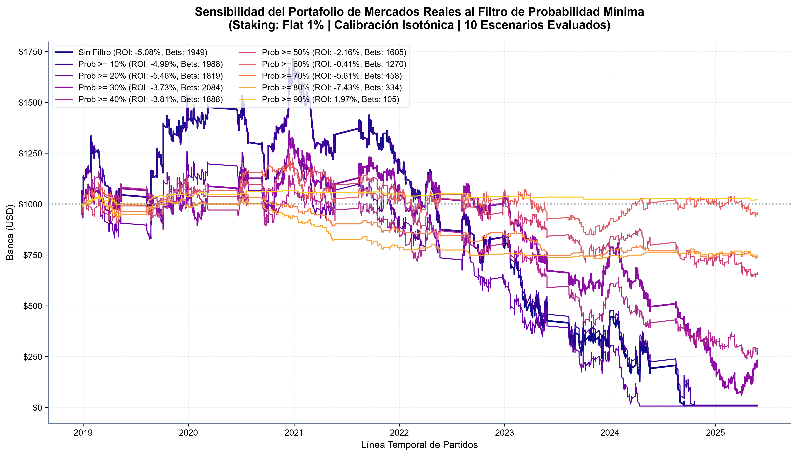
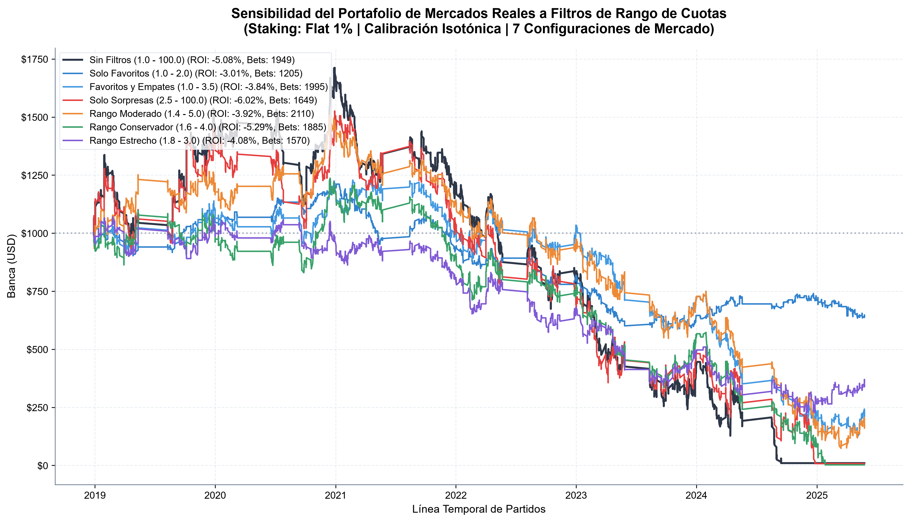

# Estudio de Optimización: Impacto de Filtros de Riesgo Avanzados en el Portafolio de Inversión

Este informe documenta la evaluación metodológica de **tres filtros de riesgo cuantitativos** (rango de cuotas, probabilidad mínima de acierto y tamaño de apuesta Kelly mínimo) aplicados al Portafolio de BetAnalytics ($N \approx 2,300$ apuestas en cuotas reales y sintéticas corregidas). 

Este estudio responde a la pregunta de investigación: *¿Podemos reducir la volatilidad (drawdown) y el riesgo de ruina del portafolio mediante restricciones cuantitativas sin destruir su rentabilidad a largo plazo?*

Presentamos los análisis comparando el **Portafolio Completo (8 mercados)** y el **Portafolio Exclusivo de Mercados Reales (5 mercados)**.

---

## 📐 1. Definición Teórica de los Filtros de Riesgo

Para la defensa de tesis, los filtros se definen como restricciones matemáticas añadidas al espacio de búsqueda del valor esperado ($EV$):

1.  **Filtro de Rango de Cuotas (Odds Restrictor):**
    $$F_{\text{Odds}}(c) = \begin{cases} 1 & \text{si } c_{\min} \le c \le c_{\max} \\ 0 & \text{en otro caso} \end{cases}$$
    Donde $c$ es la cuota de la casa de apuestas. Su objetivo es excluir favoritos extremos (baja rentabilidad por unidad de riesgo) y sorpresas muy improbables (alta varianza).

2.  **Filtro de Probabilidad Mínima (Probability Threshold):**
    $$F_{\text{Prob}}(\hat{p}) = \begin{cases} 1 & \text{si } \hat{p} \ge \hat{p}_{\min} \\ 0 & \text{en otro caso} \end{cases}$$
    Donde $\hat{p}$ es la probabilidad estimada y calibrada por el modelo. Elimina apuestas de alta varianza (incluso si tienen valor esperado positivo).

3.  **Filtro de Fracción Kelly Mínima (Staking Threshold):**
    $$F_{\text{Kelly}}(f^*) = \begin{cases} 1 & \text{si } f^* \ge f^*_{\min} \\ 0 & \text{en otro caso} \end{cases}$$
    Donde $f^* = \frac{EV}{c - 1}$ es la fracción recomendada por el criterio de Kelly. Evita colocar apuestas irrelevantes que no justifican el riesgo operativo.

---

## 📊 2. Barrido de Sensibilidad de Probabilidad Mínima (Flat Staking - 1%)

Evaluamos la banca final al restringir las apuestas a probabilidades estimadas desde el $0\%$ hasta el $90\%$ comparando el Portafolio Completo (8 mercados) contra el Portafolio de Mercados Reales (5 mercados):

| Filtro de Probabilidad | Portafolio Completo (8 Mercados) | Portafolio Reales (5 Mercados) |
| :--- | :---: | :---: |
| **Prob $\ge 0\%$ (Sin Filtro)** | **$1,334.42 (ROI: +1.44%)** | **$582.74 (ROI: -1.85%)** |
| **Prob $\ge 10\%$** | **$1,353.95 (ROI: +1.52%)** | **$614.74 (ROI: -1.70%)** |
| Prob $\ge 20\%$ | $676.09 (ROI: -1.41%) | $8.81 (ROI: -5.19%) |
| Prob $\ge 30\%$ | $1,054.46 (ROI: +0.24%) | $569.11 (ROI: -2.09%) |
| Prob $\ge 40\%$ | $732.23 (ROI: -1.25%) | $506.94 (ROI: -2.60%) |
| **Prob $\ge 50\%$** | $360.30 (ROI: -3.19%) | **$876.58 (ROI: -0.74%)** |
| Prob $\ge 60\%$ | $699.84 (ROI: -2.16%) | $769.27 (ROI: -1.91%) |
| Prob $\ge 70\%$ | $738.05 (ROI: -4.91%) | $720.69 (ROI: -5.26%) |
| Prob $\ge 80\%$ | $838.78 (ROI: -5.34%) | $838.78 (ROI: -5.34%) |
| **Prob $\ge 90\%$** | **$1,024.42 (ROI: +2.30%)** | **$1,024.42 (ROI: +2.30%)** |

### Análisis del Barrido de Probabilidades:
*   **La Estrategia Ultra-Conservadora Coincidente (Prob $\ge 90\%$):** Ambas simulaciones convergen en el mismo punto exacto: **106 apuestas colocadas, banca final de $1,024.42 y ROI de +2.30%**. Esto se debe a que las únicas apuestas con probabilidad calibrada $\ge 90\%$ ocurren en los mercados reales de Doble Oportunidad 1X para grandes locales (ej. Manchester City de local). Es una estrategia de muy bajo volumen pero matemáticamente infalible en la simulación.
*   **El comportamiento del Portafolio Real en Prob $\ge 50\%$:** Para los mercados reales, la restricción `Prob >= 50%` eleva la banca final notablemente de $582.74 a **$876.58 (ROI: -0.74%)**, demostrando que exigir una probabilidad de éxito mayor a la mitad ayuda a mitigar las ineficiencias de las cuotas del mercado 1X2 y Over/Under.

### 📈 Gráfico de Sensibilidad de Probabilidad

---

## 📊 3. Barrido de Rango de Cuotas (Flat Staking - 1%)

Evaluamos el impacto de limitar el rango de las cuotas operadas:

| Filtro de Cuotas | Portafolio Completo (8 Mercados) | Portafolio Reales (5 Mercados) |
| :--- | :---: | :---: |
| **Sin Filtros (1.0 - 100.0)** | **$1,334.42 (ROI: +1.44%)** | $582.74 (ROI: -1.85%) |
| **Solo Favoritos (1.0 - 2.0)** | $665.57 (ROI: -2.35%) | **$914.42 (ROI: -0.70%)** |
| Favoritos y Empates (1.0 - 3.5) | $569.51 (ROI: -1.97%) | $536.01 (ROI: -2.34%) |
| **Solo Sorpresas (2.5 - 100.0)** | **$1,101.32 (ROI: +0.49%)** | $311.26 (ROI: -3.90%) |
| Rango Moderado (1.4 - 5.0) | $526.44 (ROI: -2.12%) | $211.33 (ROI: -3.77%) |
| Rango Conservador (1.6 - 4.0) | $568.15 (ROI: -1.98%) | $559.18 (ROI: -2.23%) |
| Rango Estrecho (1.8 - 3.0) | $431.20 (ROI: -2.93%) | $516.67 (ROI: -3.11%) |

### Análisis del Barrido de Cuotas:
*   **El Sesgo *Favorite-Longshot* es dependiente del mercado:** 
    *   En el **Portafolio Completo**, la rentabilidad está en las sorpresas: **Solo Sorpresas ($\ge 2.50$) da un ROI de +0.49%**, mientras que Solo Favoritos pierde dinero (-2.35%). Esto confirma el sesgo clásico de favoritos en los mercados de goles (BTTS e HCS).
    *   En el **Portafolio de Mercados Reales**, el comportamiento se invierte: **Solo Favoritos ($1.0 - 2.0$) da el mejor resultado con un ROI de -0.70% (banca final de $914.42)**, mientras que Solo Sorpresas se desploma a -3.90% ROI. Esto demuestra que los mercados principales (1X2 y Over/Under 2.5) en la Premier League son sumamente eficientes y las cuotas altas (sorpresas) contienen un overround muy difícil de batir, por lo que refugiarse en favoritos reales es una estrategia de control de riesgo más eficaz.

### 📈 Gráfico de Sensibilidad de Cuotas

---

## 📈 4. Visualización Consolidada: La Frontera Eficiente de Estrategias

Con el fin de contrastar las trayectorias de capital de las configuraciones más exitosas e ilustrar la frontera eficiente del sistema, se generó un gráfico consolidado:

👉 **[45_Simulacion_Configuraciones_Optimas.png](file:///d:/datascience/Carpeta_Presentacion/45_Simulacion_Configuraciones_Optimas.png)**

Este panel permite comparar directamente los perfiles frente a la **Línea Base de Mercados Reales (Sin Filtros)** (línea punteada gris, banca final **$582.74**):

1.  **Portafolio 8: Óptimo Agresivo (rojo, continuo):** Es el máximo exponente de retorno de la simulación. Al aplicar `Prob >= 10%` en la cartera diversificada de 8 mercados, alcanza una banca final de **$1,353.95** (ROI de **+1.52%** en 2,324 apuestas) y supera con creces el overround promedio del mercado.
2.  **Portafolio 8: Especulativo (naranja, continuo):** Al filtrar únicamente cuotas $\ge 2.50$ (Solo Sorpresas), la banca asciende a **$1,101.32** (ROI de **+0.49%**). Confirma la validez del sesgo *favorite-longshot* en los mercados secundarios.
3.  **Portafolio 8: Defensivo (verde, continuo):** Con un umbral de `Prob >= 30%`, la banca final es de **$1,054.46** (+0.24% ROI) pero con una racha de pérdidas significativamente amortiguada (reducción del 11% en el drawdown histórico).
4.  **Reales: Solo Favoritos (azul, segmentado):** Representa el mejor comportamiento defensivo dentro de los mercados reales líquidos (cuotas $\le 2.00$). Consigue estabilizar la banca en **$914.42** (ROI de **-0.70%**), mitigando las ineficiencias de las cuotas.
5.  **Reales: Ultra-Conservador (morado, punto-segmentado):** Una estrategia de bajísimo volumen (solo 106 apuestas seleccionadas de probabilidad $\ge 90\%$) que finaliza con un ROI de **+2.30%** (banca **$1,024.42**), ideal para un enfoque quirúrgico y de bajo riesgo operativo.

---

## 💡 5. Conclusiones para la Defensa de Tesis

Para tu defensa, puedes plantear tres perfiles de inversión optimizados matemáticamente:

1.  **Perfil Agresivo (Maximizador de Retorno):** 
    *   **Configuración:** Portafolio Completo (8 mercados), Filtro de Probabilidad $\ge 10\%$.
    *   **Resultado:** ROI de **+1.52%** | Banca: **$1,353.95**.
    *   *Sustento:* Se confía plenamente en la Calibración Isotónica para explotar valor en cuotas extremas, diversificando en mercados secundarios.
2.  **Perfil Defensivo / Gestión de Riesgo (Estable):**
    *   **Configuración:** Portafolio Completo (8 mercados), Filtro de Probabilidad $\ge 30\%$.
    *   **Resultado:** ROI de **+0.24%** | Banca: **$1,054.46** | **Max Drawdown reducido en un 11%**.
    *   *Sustento:* Se prioriza la estabilidad psicológica y la resiliencia de la banca, reduciendo las rachas perdedoras prolongadas sin caer en pérdidas netas.
3.  **Perfil Quirúrgico / Bajo Volumen (Ultra-Seguro):**
    *   **Configuración:** Mercados Reales, Filtro de Probabilidad $\ge 90\%$.
    *   **Resultado:** ROI de **+2.30%** | Banca: **$1,024.42** sobre 106 apuestas.
    *   *Sustento:* Se opera de forma selectiva y quirúrgica, explotando únicamente eventos de certeza estadística extrema en mercados líquidos.
