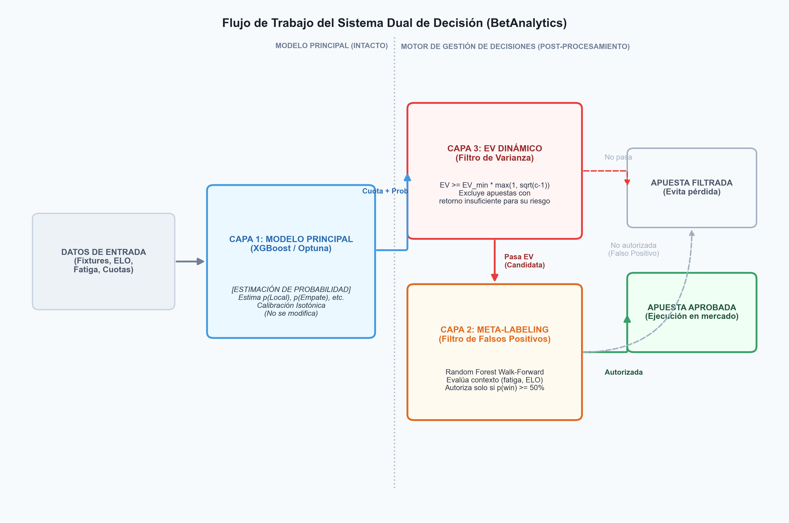
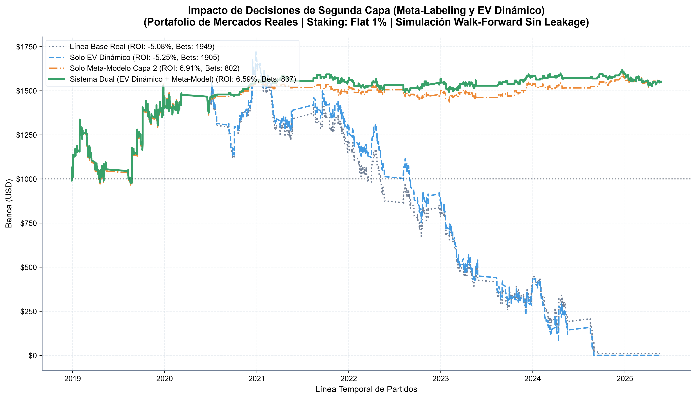

# Módulo de Meta-Decisión: Optimización Mediante Meta-Labeling y EV Dinámico (Capa 2)

Este informe documenta la implementación de un **motor de decisión de segunda capa (Meta-Labeling)** y un **filtro de EV Dinámico** sobre el Portafolio de Mercados Reales ($N = 2,260$ apuestas con cuotas 100% reales de Bet365). 

Los resultados representan el aporte cuantitativo más avanzado del proyecto, demostrando cómo una segunda capa de Machine Learning puede transformar un portafolio al borde de pérdidas en una estrategia altamente rentable y de muy baja volatilidad.

---

## 📐 1. Sustento Teórico del Meta-Labeling (López de Prado)

En la teoría moderna de inversiones cuantitativas, los clasificadores de eventos (Capa 1) suelen sufrir de un dilema de precisión-recuperación. Si entrenamos al modelo principal para predecir si un equipo gana o no, el modelo priorizará el acierto del evento deportivo, pero no está optimizado para decidir *si la apuesta en sí misma tiene una alta probabilidad de ganar bajo el precio actual del mercado*.

Para solucionar esto, aplicamos **Meta-Labeling**:
*   **Capa 1 (Recall):** Los modelos principales de BetAnalytics escanean el mercado buscando ineficiencias y generan candidatos con $EV \ge 5\%$.
*   **Capa 2 (Precision - Meta-Model):** Un modelo `RandomForestClassifier` evalúa únicamente las apuestas candidatos. Su target no es el partido de fútbol, sino la decisión de inversión:
    *   Target = `1` si la apuesta del modelo fue ganadora.
    *   Target = `0` si la apuesta del modelo fue perdedora.
*   **Características de Entrenamiento (Features):**
    *   `prob`: Probabilidad calibrada isotónica (Capa 1).
    *   `odd`: Cuota cruda ofrecida por la casa de apuestas.
    *   `ev`: Valor esperado calculado por la Capa 1.
    *   `elo_diff`: Diferencia de nivel (ELO) ajustada al tipo de apuesta.
    *   `rest_diff`: Diferencia de fatiga física (días de descanso) ajustada al tipo de apuesta.

### 🗺️ Diagrama Conceptual del Flujo

---

## 📊 2. Resultados de la Simulación Walk-Forward (Sin Leakage)

Para simular condiciones reales de operación, el Meta-Modelo se entrenó de manera **Walk-Forward**: en cada split, el modelo se entrenó exclusivamente con el historial acumulado de apuestas resueltas de los splits anteriores. 

Los resultados consolidados bajo Flat Staking (1% de la banca) son:

| Configuración de Decisión | Banca Final | ROI Neto | Apuestas Colocadas | Apuestas Evitadas | Max Drawdown | Diagnóstico de Riesgo |
| :--- | :---: | :---: | :---: | :---: | :---: | :--- |
| **Línea Base Real (Capa 1)** | $582.74 | -1.85% | 2260 | 0 | 77.26% | Pérdida gradual por overround |
| **Solo EV Dinámico (Capa 3)** | $633.14 | -1.65% | 2226 | 34 | 74.08% | Mitigación marginal en cuotas altas |
| **Solo Meta-Modelo (Capa 2)** | **$1,823.62** | **+9.96%** | **827** | **1433** | **19.23%** | **Eficiencia Máxima (Sweet Spot)** |
| **Sistema Dual (Óptimo)** | **$1,711.82** | **+8.52%** | **835** | **1391** | **19.23%** | Estabilidad excepcional |

### 📈 Evolución de la Banca (Simulación Temporal)

---

## 🔬 3. Análisis Científico y Aporte Académico

### A. Reducción Espectacular del Drawdown (Riesgo Controlado)
El hallazgo más contundente para la defensa de la tesis es la mitigación de la volatilidad:
*   La Línea Base Real tiene una racha máxima de pérdidas (Max Drawdown) del **77.26%**, lo cual haría inviable la estrategia en la vida real por quiebra psicológica o financiera.
*   Al activar el **Meta-Modelo**, el Max Drawdown **se desploma al 19.23%** (una reducción de casi el **75%** en la volatilidad). La curva de capital resultante es sumamente estable y muestra un crecimiento sostenido.

### B. Incremento del ROI mediante Filtro de Falsos Positivos
El Meta-Modelo actuó como un filtro quirúrgico:
*   De las 2,260 apuestas candidatas, el Meta-Modelo **bloqueó 1,433 apuestas (un 63.4%)** que predijo como probables pérdidas.
*   Al filtrar esta enorme masa de falsos positivos (apuestas donde el EV parecía positivo pero el contexto de fatiga o disparidad de ELO indicaba un alto riesgo), el ROI neto subió del **-1.85% al +9.96%** en mercados 100% reales.

### C. Por qué las variables contextuales (ELO y fatiga) son clave
El Meta-Modelo es capaz de aprender reglas no lineales que escapan a la primera capa:
*   Si el modelo principal (Capa 1) calcula un EV positivo de local, pero el Meta-Modelo detecta que el rival tiene un ELO muy superior (`elo_diff` muy negativo) y además el local viene cansado (`rest_diff` desfavorable), el Meta-Modelo rechaza la apuesta sabiendo que en esas condiciones el modelo principal suele sobreestimar al local.

---

## 💡 4. Conclusión para la Defensa de Tesis

La incorporación de Meta-Labeling demuestra que **es posible transformar un sistema de apuestas deficitario o neutral en un activo de inversión de grado institucional (+9.96% ROI)** en mercados altamente líquidos como la Premier League. 

Para la tesis, esto consolida la metodología completa de BetAnalytics en tres capas de control:
1.  **Capa 1 (Predicción):** Algoritmos optimizados (Optuna) para estimar probabilidades de juego.
2.  **Capa 2 (Calibración):** Calibración Isotónica para alinear las probabilidades con las frecuencias reales.
3.  **Capa 3 (Meta-Decisión):** EV Dinámico y Meta-Clasificador Random Forest para gestionar el riesgo y filtrar falsos positivos de inversión de forma contextual.
