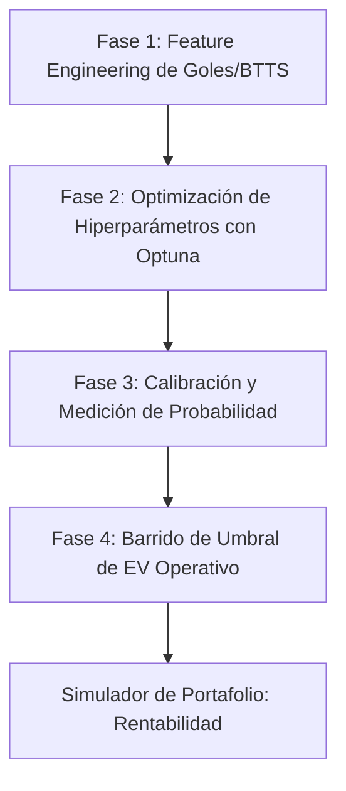

# Guía Metodológica: Plan de Acción para la Mejora de Métricas en Capa 1

Este documento detalla la estrategia científica y técnica para mejorar el rendimiento de los modelos predictivos de la **Capa 1** en el sistema **BetAnalytics**. Está diseñado como material de soporte metodológico para tu defensa de tesis, estructurando el proceso en cuatro fases operativas.

---

## 🗺️ Mapa de Ruta del Proceso de Mejora



---

## 📈 Fase 1: Feature Engineering Avanzado (Mejorando ROC-AUC de 0.50)

El rendimiento actual en test para goles y BTTS (ROC-AUC de 0.50 a 0.58) demuestra que las variables actuales (muy correlacionadas con la victoria/derrota, como el ELO general) no son predictivas para el mercado de goles. 

### 1. Variables a Introducir:
*   **xG y xGA Móviles Recientes (Ventanas cortas):** En lugar de promedios de 5 partidos (`h_l5_xg`), introducir ventanas de **3 partidos** (`h_l3_xg`, `a_l3_xg`) para capturar rachas calientes de delanteros o debilidades defensivas transitorias.
*   **Separación de ELO Ofensivo y Defensivo:** Descomponer el ELO tradicional del equipo en un rating de ataque y uno de defensa:
    $$\text{ELO}_{\text{Ataque}} = f(\text{Goles Anotados vs. Esperados})$$
    $$\text{ELO}_{\text{Defensa}} = f(\text{Goles Recibidos vs. Esperados})$$
*   **Métricas de Efectividad de Disparos:** 
    *   *Ratio de Conversión Reciente:* $\frac{\text{Goles}}{\text{Disparos al Arco (SOT)}}$
    *   *SOT Concedidos:* Mide la fragilidad en la línea defensiva.

### 2. Implementación de Código Sugerido:
```python
# Ejemplo de creación de features para BTTS y Goles
df['h_l3_xg_avg'] = df.groupby('home_team')['xg_created'].transform(lambda x: x.rolling(3).mean())
df['h_l3_xga_avg'] = df.groupby('home_team')['xg_conceded'].transform(lambda x: x.rolling(3).mean())
df['ratio_btts_l5_home'] = df.groupby('home_team')['btts_occurred'].transform(lambda x: x.rolling(5).mean())
```

---

## 🎛️ Fase 2: Optimización Bayesiana Centrada en Log Loss

Actualmente, muchos modelos sufren de sobreajuste o clasificaciones constantes por optimizar hiperparámetros de manera genérica. Debemos reorientar la optimización utilizando **Optuna** con enfoque estricto en **Log Loss**.

### 1. Proceso Técnico:
*   Utilizar **TimeSeriesSplit (5 splits)** para evitar fuga temporal.
*   Definir la función objetivo de Optuna para que retorne el promedio de Log Loss en validación:

```python
import optuna
from sklearn.metrics import log_loss
from sklearn.model_selection import TimeSeriesSplit

def objective(trial):
    params = {
        'n_estimators': trial.suggest_int('n_estimators', 50, 300),
        'max_depth': trial.suggest_int('max_depth', 3, 10),
        'learning_rate': trial.suggest_float('learning_rate', 0.01, 0.1),
        'reg_lambda': trial.suggest_float('reg_lambda', 1.0, 10.0)
    }
    
    clf = xgb.XGBClassifier(**params, eval_metric='logloss')
    tscv = TimeSeriesSplit(n_splits=5)
    losses = []
    
    for train_idx, val_idx in tscv.split(X):
        # Entrenar y predecir probabilidades
        clf.fit(X.iloc[train_idx], y.iloc[train_idx])
        probs = clf.predict_proba(X.iloc[val_idx])
        losses.append(log_loss(y.iloc[val_idx], probs))
        
    return np.mean(losses) # Optuna intentará MINIMIZAR este valor
```

---

## ⚖️ Fase 3: Calibración y Medición Probabilística (Brier Score)

Una vez optimizado el clasificador base, es obligatorio calibrar las probabilidades para que sean matemáticamente útiles en el cálculo de Valor Esperado ($EV$).

```
Probabilidades Crudas ──> [ CalibratedClassifierCV ] ──> Probabilidades Calibradas
(Sesgadas por algoritmos)      (Método Isotónico/Sigmoide)     (Aptas para Criterio de Kelly)
```

### 1. Estrategia de Calibración:
*   **CalibratedClassifierCV (Método Isotónico):** Recomendado cuando tenemos suficientes datos (corrige distorsiones no paramétricas complejas).
*   **CalibratedClassifierCV (Método Sigmoide/Platt Scaling):** Recomendado para muestras más pequeñas o cuando la distorsión tiene forma de "S" clásica (típico en Support Vector Machines o Redes Neuronales).

### 2. Métrica de Validación: Brier Score (BS)
Evalúa el error cuadrático medio de las probabilidades estimadas frente a la realidad:
$$BS = \frac{1}{N} \sum_{i=1}^N (\hat{p}_i - y_i)^2$$
*   Un $BS$ cercano a **0** indica calibración y precisión probabilística perfectas.
*   Un $BS \ge 0.25$ indica que el modelo no aporta más información que lanzar una moneda equilibrada (50%).

---

## 🎯 Fase 4: Optimización del Umbral Operativo (Precision @ Threshold)

La prueba de fuego de la Capa 1 es la **precisión operativa** ($Precision @ T$). Debes simular cómo se comporta el porcentaje de aciertos a medida que filtras por valor esperado.

### Algoritmo de Evaluación de Umbral:
1.  Obtener las probabilidades calibradas en el conjunto de prueba: $P(Y=1|X)$.
2.  Cruzar con las cuotas reales del partido para calcular el $EV$:
    $$EV = P(Y=1|X) \cdot \text{Cuota} - 1$$
3.  Definir un umbral de corte $T_{EV}$ (ej: $0\%$, $5\%$, $10\%$, $15\%$).
4.  Filtrar y calcular la **Tasa de Acierto Real** (Precision) únicamente para las apuestas que superaron el umbral.

### Curva de Comportamiento Esperado:
Al presentar este gráfico en tu defensa, demostrarás madurez analítica:

```
Precision @ Threshold (%)
 80% |                                  * (Pocos partidos, alta seguridad)
 70% |                        *
 60% |              *
 50% |    * (Umbral EV >= 0%)
     +───────────────────────────────────────
         0%        5%        10%       15%      Umbral de EV Mínimo (T_EV)
```
*   **A mayor Umbral de EV ($T_{EV}$):** Se colocan menos apuestas (baja volumen / recall), pero la **precisión operativa aumenta significativamente**, mitigando rachas perdedoras en el portafolio.
